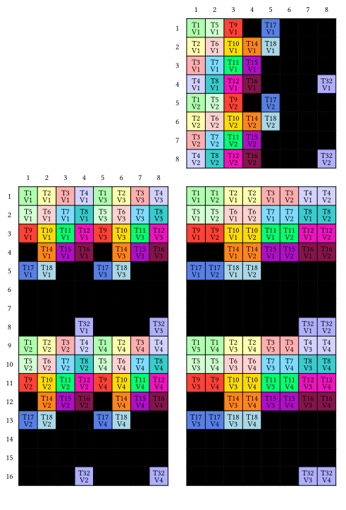
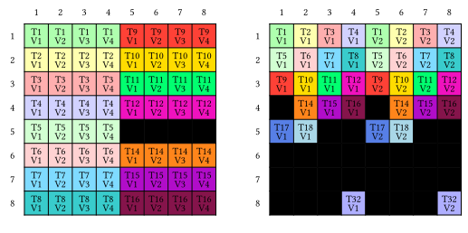

# Tensor Cores

Tensor cores are specialized hardware accelerators designed to optimize matrix operations, which are crucial for deep learning and artificial intelligence algorithms.

Enabling tensor cores can be as straightforward as modifying a single line of code in the existing `matmul_kernel` function:
```julia
mma = make_tiled_mma(MMAOP_8x8x4_F32F16F16F32_NT(), 
                     atom_layout, 
                     tiler)
```
!!! note
    The NT in MMAOP_8x8x4_F32F16F16F32_NT indicates that A is in M-major order and B is in N-major order.

Let's explore a minimal example
```julia
mma = make_tiled_mma(MMAOP_16x8x8_F32TF32TF32F32_TN())
print_typst(mma)
```


At first glance, the diagram may seem complex, but the concept is straightforward: the threads collective load data from matrices `A` and `B` according to the specified layout. During the matrix multiply-accumulate (MMA) computation, data is internally shared among threads—a process that is not transparent to the user. Once the computation is complete, each thread stores the results as dictated by the layout of matrix `C` shown in the illustration.

```julia
function matmul_kernel(A, sA_layout, copy_A,
                       B, sB_layout, copy_B,
                       C, mma)
    sA = MoYeSharedArray(eltype(A), sA_layout)
    sB = MoYeSharedArray(eltype(B), sB_layout)

    mA = MoYeArray(A)
    mB = MoYeArray(B)
    mC = MoYeArray(C)

    bM = size(sA_layout, 1)
    bN = size(sB_layout, 1)
    bK = size(sB_layout, 2)

    gA = @tile mA (bM, bK) (blockIdx().x, :)
    gB = @tile mB (bN, bK) (blockIdx().y, :)
    gC = @tile mC (bM, bN) (blockIdx().x, blockIdx().y)

    # copy partition
    thr_copy_a = get_slice(copy_A, threadIdx().x)      
    tAgA = partition_S(thr_copy_a, gA)                 # (CPY, CPY_M, CPY_K, k)
    tAsA = partition_D(thr_copy_a, sA)                 # (CPY, CPY_M, CPY_K)

    thr_copy_b = get_slice(copy_B, threadIdx().x)
    tBgB = partition_S(thr_copy_b, gB)                 # (CPY, CPY_N, CPY_K, k)
    tBsB = partition_D(thr_copy_b, sB)                 # (CPY, CPY_N, CPY_K)

    # mma partition
    thr_mma = get_slice(mma, threadIdx().x)
    tCsA = partition_A(thr_mma, sA)                    # (MMA, MMA_M, MMA_K)
    tCsB = partition_B(thr_mma, sB)                    # (MMA, MMA_M, MMA_K)
    tCgC = partition_C(thr_mma, gC)                    # (MMA, MMA_M, MMA_N)

    tCrA = make_fragment_A(thr_mma, tCsA)              # (MMA, MMA_M, MMA_K)
    tCrB = make_fragment_B(thr_mma, tCsB) 
    tCrC = make_fragment_C(thr_mma, tCgC)
    zeros!(tCrC)

    # copy from global to shared
    copyto!(copy_A, tAsA, view(tAgA, :, :, :, _1))
    copyto!(copy_B, tBsB, view(tBgB, :, :, :, _1))
    
    cp_async_wait()

    # copy from shared to registers
    copyto!(tCrA, tCsA)
    copyto!(tCrB, tCsB)

    @gc_preserve gemm!(mma, tCrC, tCrA, tCrB, tCrC)

    copyto!(tCgC, tCrC) 
    @inbounds tCrC[1]  # compiler bug, have to load after copyto!

    return nothing
end

function matmul(A, B, C)
    bM = _16
    bN = _8
    bK = _8
    
    sA_layout = make_layout((bM, bK), (_1, bM))
    sB_layout = make_layout((bN, bK), (bK, _1))

    TA = eltype(A)
    TB = eltype(B)
    TC = eltype(C)
	
    copy_A = make_tiled_copy(CopyAtom{CPOP_ASYNC_CACHEALWAYS{UInt128}, TA}(),
                             @Layout((4, 8)),
                             @Layout((4, 1)))
    copy_B = make_tiled_copy(CopyAtom{CPOP_ASYNC_CACHEALWAYS{UInt64}, TB}(),
                             @Layout((8, 4), (4, 1)),
                             @Layout((1, 2)))

    mma = make_tiled_mma(MMAOP_16x8x8_F32TF32TF32F32_TN()) 

    threads = Int(size(mma))
    blocks = (cld(size(A, 1), bM), cld(size(B, 1), bN))

    @cuda threads=threads blocks=blocks matmul_kernel(A, sA_layout, copy_A, 
                                                      B, sB_layout, copy_B, 
                                                      C, mma)
end

function test()
    A =  CuArray(reshape(collect(1:16*8) .* 1f0, (16,8))) 
    B =  CuArray(reshape(collect(1:8*8) .* 1f0, (8,8)))
    C =  CuArray(ones(Float32, (16,8)))
    matmul(A, B', C)
    CUDA.synchronize()
    @test C == A * B
    CUDA.unsafe_free!(A)
    CUDA.unsafe_free!(B)
    CUDA.unsafe_free!(C)
end
```


## LDMatrix

The `ldmatrix` instruction at the warp level facilitates the loading of data from shared memory into registers and suffles them to align with a tensor core MMA operation.

Given a tensor core MMA operation, the shuffling can be "inverted" to obtain a `TiledCopy` count for the shuffling.
```julia
mma = make_tiled_mma(MMAOP_16x8x8_F32TF32TF32F32_TN())
smem_copy_A = make_tiled_copy_A(CopyAtom{LDSM_U32x4_N, Float32}(), mma)
print_typst(smem_copy_A)
```


The resulting layout on the right hand side matches the layout of A in the `mma`.

!!! note
    The `TN` in `MMAOP_16x8x8_F32TF32TF32F32_TN` means that both A and B are in `K`-major order.
    The `N` in `LDSM_U32x4_N` means the source array is `K`-major order.

!!! note 
    The `ldmatrix` requires four consecutive threads to load 16 consecutive bytes, demanding that the layout of `A` in shared memory meet this specification.

For B:
```julia
smem_copy_B = make_tiled_copy_B(CopyAtom{LDSM_U32x2_N, Float32}(), mma)
print_typst(smem_copy_B)
```



!!! Note
    The visualization of `B` in `mma` is draw as `(K, N)` but `(N, K)` in `smem_copy_B`.

We then use `smem_copy_A` and `smem_copy_B` to re-tile the shared memory and registers
```julia
smem_thr_copy_A = get_slice(smem_copy_A, threadIdx().x)
smem_thr_copy_B = get_slice(smem_copy_B, threadIdx().x)
tCsA_retiled = partition_S(smem_thr_copy_A, sA)
tCsB_retiled = partition_S(smem_thr_copy_B, sB)
tCrA_retiled = retile_D(smem_thr_copy_A, tCrA)
tCrB_retiled = retile_D(smem_thr_copy_B, tCrB)
```

Complete code:
```julia
function matmul_kernel(A, sA_layout, gmem_copy_A, smem_copy_A,
                       B, sB_layout, gmem_copy_B, smem_copy_B,
                       C, mma)
    sA = MoYeSharedArray(eltype(A), sA_layout)
    sB = MoYeSharedArray(eltype(B), sB_layout)

    mA = MoYeArray(A)
    mB = MoYeArray(B)
    mC = MoYeArray(C)

    bM = size(sA_layout, 1)
    bN = size(sB_layout, 1)
    bK = size(sB_layout, 2)

    gA = @tile mA (bM, bK) (blockIdx().x, :)
    gB = @tile mB (bN, bK) (blockIdx().y, :)
    gC = @tile mC (bM, bN) (blockIdx().x, blockIdx().y)

    # gmem copy partition
    gmem_thr_copy_a = get_slice(gmem_copy_A, threadIdx().x)      
    tAgA = partition_S(gmem_thr_copy_a, gA)                 # (CPY, CPY_M, CPY_K, k)
    tAsA = partition_D(gmem_thr_copy_a, sA)                 # (CPY, CPY_M, CPY_K)

    gmem_thr_copy_b = get_slice(gmem_copy_B, threadIdx().x)
    tBgB = partition_S(gmem_thr_copy_b, gB)                 # (CPY, CPY_N, CPY_K, k)
    tBsB = partition_D(gmem_thr_copy_b, sB)                 # (CPY, CPY_N, CPY_K)

    # copy from global to shared
    copyto!(gmem_copy_A, tAsA, view(tAgA, :, :, :, _1))
    copyto!(gmem_copy_B, tBsB, view(tBgB, :, :, :, _1))

    # mma partition
    thr_mma = get_slice(mma, threadIdx().x)
    tCsA = partition_A(thr_mma, sA)                    # (MMA, MMA_M, MMA_K)
    tCsB = partition_B(thr_mma, sB)                    # (MMA, MMA_M, MMA_K)
    tCgC = partition_C(thr_mma, gC)                    # (MMA, MMA_M, MMA_N)

    tCrA = make_fragment_A(thr_mma, tCsA)              # (MMA, MMA_M, MMA_K)
    tCrB = make_fragment_B(thr_mma, tCsB)              # (MMA, MMA_N, MMA_K)
    tCrC = make_fragment_C(thr_mma, tCgC)              # (MMA, MMA_M, MMA_N)
    zeros!(tCrC)

    # retile 
    smem_thr_copy_A = get_slice(smem_copy_A, threadIdx().x)
    smem_thr_copy_B = get_slice(smem_copy_B, threadIdx().x)
    tCsA_retiled = partition_S(smem_thr_copy_A, sA)
    tCsB_retiled = partition_S(smem_thr_copy_B, sB)
    tCrA_retiled = retile_D(smem_thr_copy_A, tCrA)
    tCrB_retiled = retile_D(smem_thr_copy_B, tCrB)
    
    cp_async_wait()

    # copy from shared to registers
    copyto!(smem_copy_A, tCrA_retiled, tCsA_retiled)
    copyto!(smem_copy_B, tCrB_retiled, tCsB_retiled)

    @gc_preserve gemm!(mma, tCrC, tCrA, tCrB, tCrC)

    copyto!(tCgC, tCrC) 
    @inbounds tCrC[1]  # compiler bug, have to load after copyto!

    return nothing
end


function matmul(A, B, C)
    bM = _16
    bN = _8
    bK = _8
    
    sA_layout = make_layout((bM, bK), (_1, bM))
    sB_layout = make_layout((bN, bK), (bK, _1))

    TA = eltype(A)
    TB = eltype(B)
    TC = eltype(C)
	
    gmem_copy_A = make_tiled_copy(CopyAtom{CPOP_ASYNC_CACHEALWAYS{UInt128}, TA}(),
                                  @Layout((4, 8)),
                                  @Layout((4, 1)))
    gmem_copy_B = make_tiled_copy(CopyAtom{CPOP_ASYNC_CACHEALWAYS{UInt64}, TB}(),
                                  @Layout((8, 4), (4, 1)),
                                  @Layout((1, 2)))

    mma = make_tiled_mma(MMAOP_16x8x8_F32TF32TF32F32_TN()) 

    # Note: A is M-major so we can only use `UniversalCopy`
    smem_copy_A =  make_tiled_copy_A(CopyAtom{UniversalCopy{TA}, TA}(), mma)
    smem_copy_B =  make_tiled_copy_B(CopyAtom{LDSM_U32x2_N, TB}(), mma)

    threads = Int(size(mma))
    blocks = (cld(size(A, 1), bM), cld(size(B, 1), bN))

    @cuda threads=threads blocks=blocks matmul_kernel(A, sA_layout, gmem_copy_A, smem_copy_A,
                                                      B, sB_layout, gmem_copy_B, smem_copy_B,
                                                      C, mma)
end

```

## Double buffering


```julia
@views function matmul_kernel(A, sA_layout, gmem_copy_A, smem_copy_A,
                              B, sB_layout, gmem_copy_B, smem_copy_B,
                              C, mma)
    sA = MoYeSharedArray(eltype(A), sA_layout)        # (bM, bK, 2)
    sB = MoYeSharedArray(eltype(B), sB_layout)        # (bN, bK, 2)

    mA = MoYeArray(A)
    mB = MoYeArray(B)
    mC = MoYeArray(C)

    bM = size(sA_layout, 1)
    bN = size(sB_layout, 1)
    bK = size(sB_layout, 2)

    gA = @tile mA (bM, bK) (blockIdx().x, :)
    gB = @tile mB (bN, bK) (blockIdx().y, :)
    gC = @tile mC (bM, bN) (blockIdx().x, blockIdx().y)

    # gmem copy partition
    gmem_thr_copy_A = get_slice(gmem_copy_A, threadIdx().x)      
    tAgA = partition_S(gmem_thr_copy_A, gA)                 # (CPY, CPY_M, CPY_K, k)
    tAsA = partition_D(gmem_thr_copy_A, sA)                 # (CPY, CPY_M, CPY_K, 2)

    gmem_thr_copy_B = get_slice(gmem_copy_B, threadIdx().x)
    tBgB = partition_S(gmem_thr_copy_B, gB)                 # (CPY, CPY_N, CPY_K, k)
    tBsB = partition_D(gmem_thr_copy_B, sB)                 # (CPY, CPY_N, CPY_K, 2)

    # Copy gmem to smem for k_tile=1
    copyto!(gmem_copy_A, tAsA[:, :, :, _1], tAgA[:, :, :, _1])
    copyto!(gmem_copy_B, tBsB[:, :, :, _1], tBgB[:, :, :, _1])

    # mma partition
    thr_mma = get_slice(mma, threadIdx().x)
    tCsA = partition_A(thr_mma, sA)                         # (MMA, MMA_M, MMA_K, 2)
    tCsB = partition_B(thr_mma, sB)                         # (MMA, MMA_M, MMA_K, 2)
    tCgC = partition_C(thr_mma, gC)                         # (MMA, MMA_M, MMA_N)

    tCrA = make_fragment_A(thr_mma, tCsA[:, :, :, _1])      # (MMA, MMA_M, MMA_K)
    tCrB = make_fragment_B(thr_mma, tCsB[:, :, :, _1])      # (MMA, MMA_N, MMA_K)
    tCrC = make_fragment_C(thr_mma, tCgC)                   # (MMA, MMA_M, MMA_N)
    zeros!(tCrC)

    # retile 
    smem_thr_copy_A = get_slice(smem_copy_A, threadIdx().x)   
    smem_thr_copy_B = get_slice(smem_copy_B, threadIdx().x)   
    tCsA_retiled = partition_S(smem_thr_copy_A, sA)         # (MMA, MMA_M, MMA_K, 2)   
    tCsB_retiled = partition_S(smem_thr_copy_B, sB)         # (MMA, MMA_N, MMA_K, 2)      
    tCrA_retiled = retile_D(smem_thr_copy_A, tCrA)          # (MMA, MMA_M, MMA_K)    
    tCrB_retiled = retile_D(smem_thr_copy_B, tCrB)          # (MMA, MMA_N, MMA_K)    

    cp_async_wait()
    sync_threads()

    # Copy smem to rmem for k_block=1
    smem_read = 1
    smem_write = 2
    tCsA_p = view(tCsA_retiled, :, :, :, smem_read)
    tCsB_p = view(tCsB_retiled, :, :, :, smem_read)
    copyto!(smem_copy_A, tCrA_retiled[:, :, _1], tCsA_p[:, :, _1])
    copyto!(smem_copy_B, tCrB_retiled[:, :, _1], tCsB_p[:, :, _1])

    k_tile_max = size(tAgA, 4)
    k_block_max = static_size(tCrA, 3)
    for k_tile in 1:k_tile_max
        @loopinfo unroll for k_block in _1:k_block_max
            k_block_next = k_block + 1 
            if k_block == k_block_max
                cp_async_wait()
                sync_threads()
                tCsA_p = view(tCsA_retiled, :, :, :, smem_read)
                tCsB_p = view(tCsB_retiled, :, :, :, smem_read)
                k_block_next = 1
            end
            
            copyto!(smem_copy_A, tCrA_retiled[:, :, k_block_next], tCsA_p[:, :, k_block_next])
            copyto!(smem_copy_B, tCrB_retiled[:, :, k_block_next], tCsB_p[:, :, k_block_next])   

            if k_block == _1 && k_tile<k_tile_max
                copyto!(gmem_copy_A, tAsA[:, :, :, smem_write], tAgA[:, :, :, k_tile+1])
                copyto!(gmem_copy_B, tBsB[:, :, :, smem_write], tBgB[:, :, :, k_tile+1])
                smem_read, smem_write = smem_write, smem_read
            end
            
            @gc_preserve gemm!(mma, tCrC, tCrA[:, :, k_block], tCrB[:, :, k_block], tCrC)
        end
    end

    copyto!(tCgC, tCrC)
    sync_threads()
    return nothing
end


function matmul(A, B, C)
    bM = _128
    bN = _128
    bK = _16

    TA = eltype(A)
    TB = eltype(B)
    TC = eltype(C)
	
    mma = make_tiled_mma(MMAOP_16x8x8_F32TF32TF32F32_TN(), 
                         @Layout((2,2,1), (2,1,1)),
                         (_32,_32,_8))

    gmem_copy_A = make_tiled_copy(CopyAtom{CPOP_ASYNC_CACHEALWAYS{UInt128}, TA}(),
                                  @Layout((16, 8)),
                                  @Layout((4, 1)))
    gmem_copy_B = make_tiled_copy(CopyAtom{CPOP_ASYNC_CACHEALWAYS{UInt128}, TB}(),
                                  @Layout((32, 4), (4, 1)),
                                  @Layout((1, 4)))

    # A is M-major so we cannot use LDSM_U32x4_N 
    smem_copy_A = make_tiled_copy_A(CopyAtom{UniversalCopy{TA}, TA}(), mma)
    smem_copy_B = make_tiled_copy_B(CopyAtom{LDSM_U32x4_N, TB}(), mma)

    sA_layout = @Layout (128, 16, 2) (1, 128, 2048)
    sB_layout = @Layout (128, 16, 2) (16, 1,  2048)
    
    tile_to_shape(sB_atom_layout, (bN, bK, _2))

 
    threads = Int(size(mma))
    blocks = (cld(size(A, 1), bM), cld(size(B, 1), bN))

    @cuda threads=threads blocks=blocks matmul_kernel(A, sA_layout, gmem_copy_A, smem_copy_A,
                                                      B, sB_layout, gmem_copy_B, smem_copy_B,
                                                      C, mma)
end


function test()
    A = CUDA.randn(Float32, 2048, 256)   # M-major
    B = CUDA.randn(Float32, 256, 2048)   # K-major
    C =  CUDA.randn(Float32, 2048, 2048)
    matmul(A, B', C)
    CUDA.synchronize()
    @test C == A * B
    CUDA.unsafe_free!(A)
    CUDA.unsafe_free!(B)
    CUDA.unsafe_free!(C)
end

test()
```