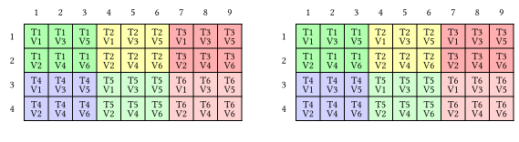
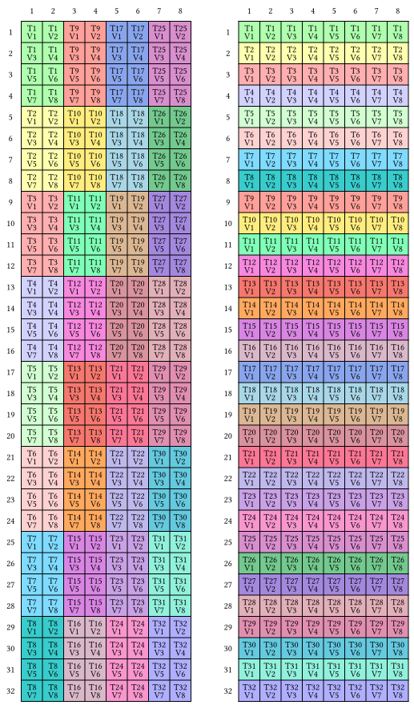

Tiled Copy

We have already introduced how to copy data using @tile and @partition. This process might still appear somewhat cumbersome, and `TiledCopy` serves to simplify it.

Consider the following example where we employ six threads to transfer an array src of shape (4, 9) into another array dst with the identical shape. The relationship mapping logic coordinates to thread IDs can be visualized as:

```julia
1 1 1 2 2 2 3 3 3
1 1 1 2 2 2 3 3 3
4 4 4 5 5 5 6 6 6
4 4 4 5 5 5 6 6 6
```
Here, each thread is assigned a data segment defined by the layout (2,3):(1,2). The group of threads operates within a layout of (2,3):(3,1), referred to as `val_layout` and `thr_layout`, respectively.

To begin, we initialize these arrays:

```@repl tiled_copy
using MoYe
src_buffer = collect(1:36) .* 0.1;
src = MoYeArray(src_buffer, @Layout((4,9)))
dst_buffer = zeros(36);
dst = MoYeArray(dst_buffer, make_layout((_4,_9)));
```

We then proceed to set up a `TiledCopy`:
```@repl tiled_copy
thr_layout = @Layout (2, 3) (3, 1)
val_layout = @Layout (2, 3) (1, 2)
tiled_copy = make_tiled_copy(
	CopyAtom{UniversalCopy{Float64}, Float64}(),
	thr_layout, 
	val_layout)
```

The second parameter Float64 in CopyAtom indicates that the copied data is of `Float64` type. `UniversalCopy{Float64}` is used for vectorized copy operations, meaning that the data is recast to Float64, i.e., without vectorization. You can also use `UniversalCopy{UInt128}` to enable vectoried load and stores.

You can visualize this TiledCopy by using `print_typst(tiled_copy)`. Visit [typst](https://typst.app), copy the printed string, and you will see the following image:




The two tables respectively represent the thread distribution of src and dst, which are the same here. There are also some PTX instructions involved in reallocating each thread's data, for example:
```@repl tiled_copy
print_typst(make_tiled_copy(MoYe.CopyAtom{LDSM_U32x4_N, UInt16}(),
                                   @Layout((32,1)), @Layout((1,8))));
```



As you can see, both thr_layout and val_layout are actually defined on dst.

Returning to our example, after making the TiledCopy, we can use it to partition data.

```@repl tiled_copy
thr_idx = 2;
thr_copy = get_slice(tiled_copy, thr_idx);
dst_t = partition_D(thr_copy, dst);
src_t = partition_S(thr_copy, src);
copyto!(tiled_copy, dst_t, src_t);
dst
```

You can see that the second thread has completed the copy.

The NVIDIA Ampere architecture supports cuda::memcpy_async for asynchronously copying data between GPU global memory and shared memory without needing threads to orchestrate the data movement. In previous architectures, copying from global memory to shared memory usually involved registers for intermediation, corresponding to this syntax:
```@repl tiled_copy
thr_idx = 3;
thr_copy = get_slice(tiled_copy, thr_idx);
dst_t = partition_D(thr_copy, dst);
src_t = partition_S(thr_copy, src);

dst_r = make_fragment_like(dst_t);
copyto!(tiled_copy, dst_r, src_t);
copyto!(tiled_copy, dst_t, dst_r);
dst
```

## MatMul

Now, we use TiledCopy to upgrade the previous matmul_kernel.

```julia
function matmul_kernel(A, sA_layout, copy_A,
                       B, sB_layout, copy_B,
                       C, tC)
    M = size(A, 1)
    N = size(B, 1)
    K = size(A, 2)

    bM = size(sA_layout, 1)
    bN = size(sB_layout, 1)
    bK = size(sB_layout, 2)

    sA = MoYeSharedArray(eltype(A), sA_layout)
    sB = MoYeSharedArray(eltype(B), sB_layout)

    mA = MoYeArray(A, (M, K))
    mB = MoYeArray(B, (N, K))
    mC = MoYeArray(C, (M, N))

    gA = @tile mA (bM, bK) (blockIdx().x, :)
    gB = @tile mB (bN, bK) (blockIdx().y, :)
    gC = @tile mC (bM, bN) (blockIdx().x, blockIdx().y)

    # copy partition
    thr_copy_a = get_slice(copy_A, Int(threadIdx().x))
    tAgA = partition_S(thr_copy_a, gA) # (Val, CopyM, CopyK, k)
    tAsA = partition_D(thr_copy_a, sA)
	tArA = make_fragment_like(tAsA)

    thr_copy_b = get_slice(copy_B, Int(threadIdx().x))
    tBgB = partition_S(thr_copy_b, gB)
    tBsB = partition_D(thr_copy_b, sB)
	tBrB = make_fragment_like(tBsB)

    # mma partition
    tCsA = @parallelize sA tC threadIdx().x (1, :) 
    tCsB = @parallelize sB tC threadIdx().x (:, 1)
    tCgC = @parallelize gC tC threadIdx().x 

	# overlap copy and compute
	copyto!(copy_A, tArA, view(tAgA, :, :, :, 1))
	copyto!(copy_B, tBrB, view(tBgB, :, :, :, 1))

	# accumulator
    tCrC = similar(tCgC)
    zeros!(tCrC)

	k_max = size(tAgA, 4)
    for k in 1:k_max
        sync_threads()
        copyto!(tAsA, tArA)
        copyto!(tBsB, tBrB)
        sync_threads()

		# load the next tile
		k_next = k < k_max ? k+1 : k
		copyto!(copy_A, tArA, view(tAgA, :, :, :, k_next))
		copyto!(copy_B, tBrB, view(tBgB, :, :, :, k_next))

        @gc_preserve gemm!(tCsA, tCsB, tCrC)
        sync_threads()
    end


    copyto!(tCgC, tCrC)
    return nothing
end


function matmul(A, B, C)
    bM = _128
    bN = _128
    bK = _8
    
    sA_layout = make_layout((bM, bK), (_1, bM + _1))
    sB_layout = make_layout((bN, bK), (_1, bN + _1))

	TA = eltype(A)
	TB = eltype(B)
	
    copy_A = make_tiled_copy(CopyAtom{UniversalCopy{TA}, TA}(),
                             @Layout((32, 8)),
                             @Layout((4, 1)))
    copy_B = make_tiled_copy(CopyAtom{UniversalCopy{TB}, TB}(),
                             @Layout((32, 8)),
                             @Layout((4, 1)))

    tC = @Layout (16, 16)

    threads = Int(size(tC))
    blocks = (cld(size(A, 1), bM), cld(size(B, 1), bN))

    @cuda threads=threads blocks=blocks matmul_kernel(A, sA_layout, copy_A,
                                                      B, sB_layout, copy_B,
                                                      C, tC)
end

function test()
    A =  CUDA.randn(Float32, 2048, 256)
    B =  CUDA.randn(Float32, 2048, 256)
    C =  CUDA.randn(Float32, 2048, 2048)
    matmul(A, B, C)
    CUDA.synchronize()
    @test C == A * B'
    CUDA.unsafe_free!(A)
    CUDA.unsafe_free!(B)
    CUDA.unsafe_free!(C)
end

test()
```